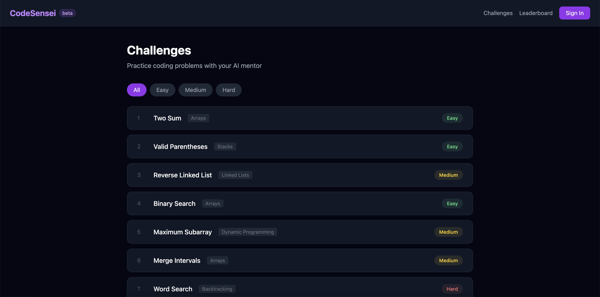
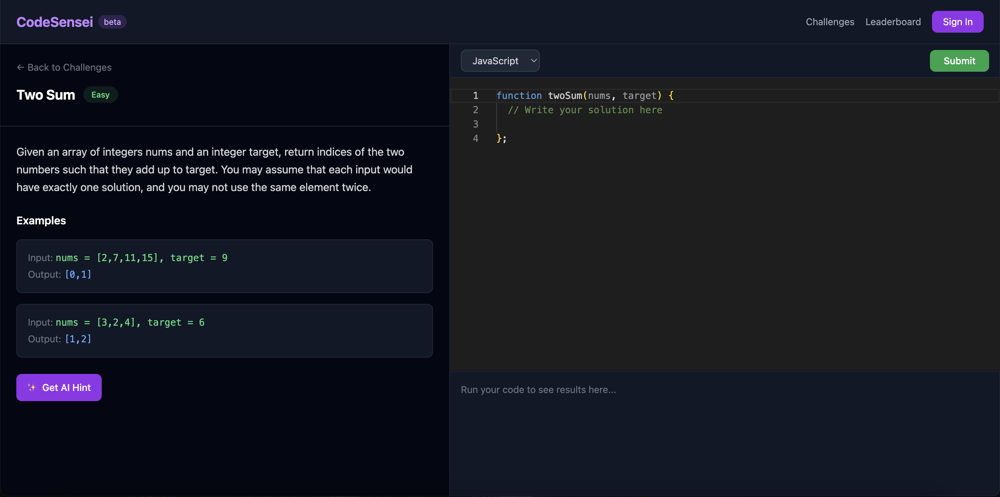
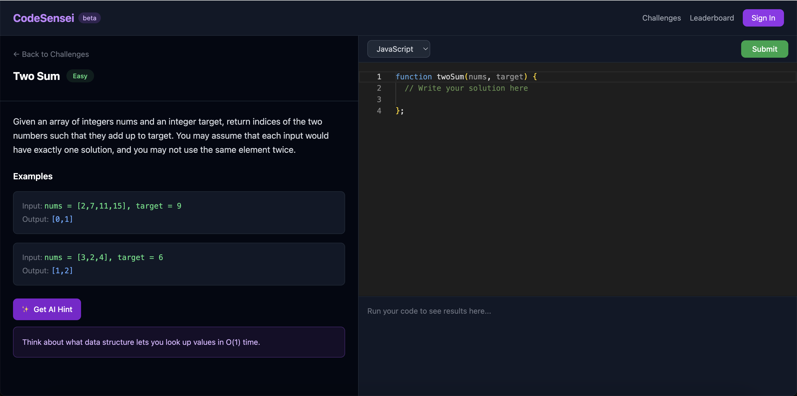
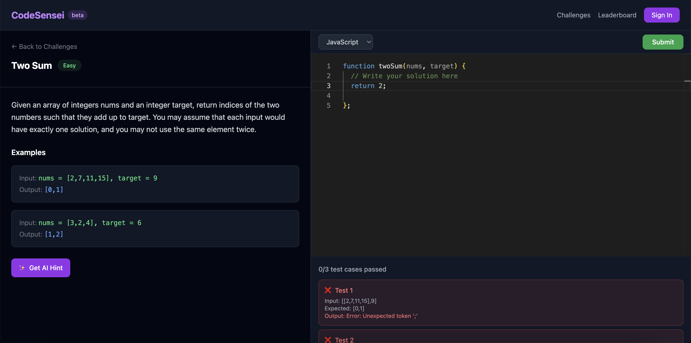
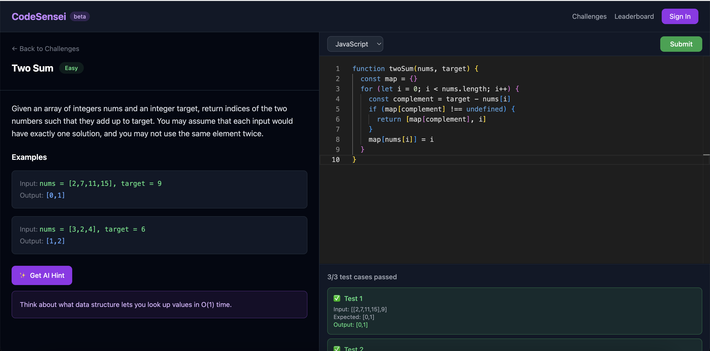
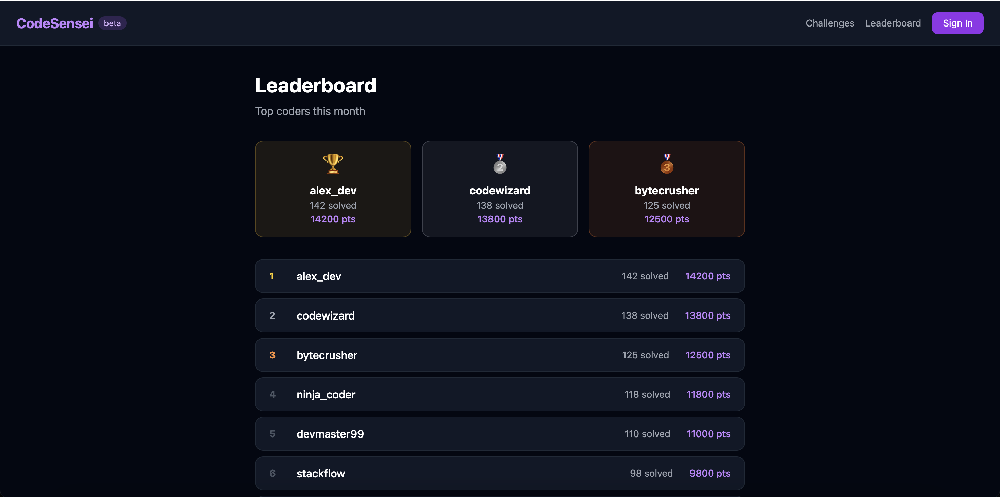

# CodeSensei 🥷

> AI-powered coding interview prep platform — practice challenges with an intelligent mentor that gives you progressive hints without spoiling the solution.



---

## What is CodeSensei?

CodeSensei is a full-stack web platform where developers can practice coding challenges with an AI mentor built in. It combines a real code editor, automated test execution, and a GPT-4 powered hint system that coaches you progressively — like a real sensei.

Built as a showcase project targeting companies working on AI-integrated developer tools.

---

## Features

### 🧩 Coding Challenges
Browse challenges filtered by difficulty (Easy / Medium / Hard), each with a description, examples, and a starter code template.


### ✍️ In-Browser Code Editor
Powered by **Monaco Editor** (the same engine behind VS Code) — syntax highlighting, line numbers, and language support out of the box.



### ✨ AI Hint System (GPT-4)
Stuck? Click **Get AI Hint** and CodeSensei gives you a progressive hint based on your current code and how many attempts you've made. First hint is vague, third hint is almost the answer — just like a real mentor.



### ✅ Automated Test Execution
Submit your solution and instantly see which test cases pass or fail — with input, expected output, and actual output shown for each case.

**Failed tests:**



**Passed tests:**



### 🏆 Leaderboard
Track the top coders on the platform with a ranked leaderboard showing solved count and points.



---

## Tech Stack

### Frontend
| Technology | Purpose |
|---|---|
| React + TypeScript | UI framework |
| Vite | Build tool |
| Tailwind CSS | Styling |
| Monaco Editor | In-browser code editor |
| React Router | Client-side routing |
| Supabase JS | Database client |

### Backend
| Technology | Purpose |
|---|---|
| Node.js + Express | API server |
| OpenAI API (GPT-4) | AI hint generation |
| express-rate-limit | API protection |

### Infrastructure
| Technology | Purpose |
|---|---|
| Supabase (PostgreSQL) | Database for challenges and leaderboard |
| Vercel | Frontend deployment |
| Railway | Backend deployment |

---

## Architecture
┌─────────────────┐     ┌─────────────────┐     ┌─────────────────┐
│                 │     │                 │     │                 │
│  React Frontend │────▶│  Express Backend│────▶│   OpenAI API    │
│  (Vercel)       │     │  (Railway)      │     │   GPT-4 Hints   │
│                 │     │                 │     │                 │
└────────┬────────┘     └─────────────────┘     └─────────────────┘
│
▼
┌─────────────────┐
│                 │
│    Supabase     │
│  (PostgreSQL)   │
│  Challenges +   │
│  Leaderboard    │
│                 │
└─────────────────┘
---

## Local Development

### Prerequisites
- Node.js 18+
- npm

### Frontend Setup
```bash
cd frontend
npm install
```

Create `frontend/.env`:
VITE_SUPABASE_URL=your_supabase_url
VITE_SUPABASE_ANON_KEY=your_supabase_anon_key
```bash
npm run dev
```

### Backend Setup
```bash
cd backend
npm install
```

Create `backend/.env`:
OPENAI_API_KEY=your_openai_key
PORT=3001
```bash
node index.js
```

---

## Project Structure
CodeSensei/
├── frontend/
│   ├── src/
│   │   ├── components/
│   │   │   └── Navbar.tsx
│   │   ├── pages/
│   │   │   ├── Home.tsx
│   │   │   ├── Challenge.tsx
│   │   │   └── Leaderboard.tsx
│   │   ├── lib/
│   │   │   └── supabase.ts
│   │   └── types/
│   └── package.json
├── backend/
│   ├── index.js
│   └── package.json
├── screenshots/
└── README.md
---

## Author

**Gligorco Gligorov** — Full-Stack Developer
- Portfolio: [gligorcogligorov.vercel.app](https://gligorcogligorov.vercel.app)
